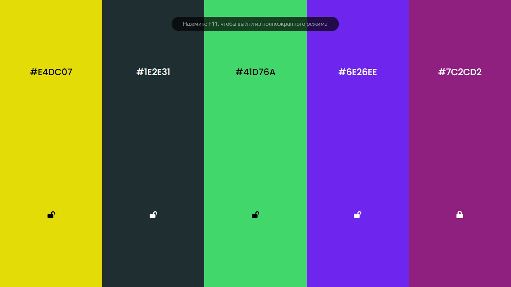

<h1><a href="https://colours-beta.vercel.app/">Colours</a></h1>

The Colors app is adaptive to all devices, written in ReactJS, the site's features are:   - When you click on the swipe button, the colors that are not blocked are updated   - Copying when you click on text #00FF22   - On mobile devices, when you swipe down and up, the colors that are not blocked are updated

